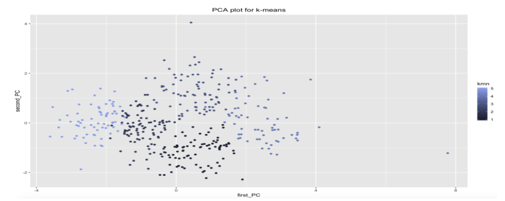

In this project, algorithms for k-means, hierarchical agglomerative clustering with single link and Spectral clustering were implemented and test on 2 datasets i.e. cho.txt and iyer.txt. All of these, three algorithms are clustering techniques and are used to find pattern in the data. The centers for k- means were initially selected through forgy algorithm. A function for calculating Euclidian distance among points was defined. The distance between each of the centroids and point was calculated and the point was put in the cluster which had the smallest distance with the point and the centroid mean was calculated again. The process was repeated for 10 iterations.
As part of the project, hierarchical agglomerative clustering with single link algorithm was also used for clustering of each dataset. First of all, the distance matrix was calculated. Each point acted as a cluster. The 2 clusters with the minimum distance were put together in a group and distance matrix was re-evaluated. The process was repeated until only one cluster remained. Spectral clustering was also implemented, which makes use of eigen vectors and eigen values. An embedded space of eigen vectors was created and k-means was applied to the reduced space to get k clusters.
Rand index was used for checking the validation of clusters and PCA was used for displaying plots on console. Figure 1 contains the plot for k-means implementation for dataset cho, figure 2 contains the hierarchical agglomerative clustering with single link implementation of that dataset and figure 3 contains the k-way clustering implementation. Similarly, figure 2 contains the implementations for datasets iyer.

## RAND Index ##

| ALgorithm                | cho.txt | iyer.txt |
|--------------------------|:---------:|----------:|
| k-mean                   | 0.783   | 0.767    |
| Agglomerative clustering | 0.239   | 0.187    |
| Spectral clustering      | 0.797   | 0.629    |

It can be seen from the table, k-means algorithm performed relatively well for both data sets, however this performance is reduced when clusters are of different sizes, densities and irregular shapes. K- means calculates the clusters relatively quickly than the other two algorithms as well. However, there are some problems with k-mean algorithms; the efficiency of k-means varies with varying initial centroids and also differing clusters are produced consequently.
Agglomerative hierarchical clustering with single link (min) can handle non-elliptical shapes but it is very sensitive to outliers which reduces its efficiency a lot. Spectral clustering gives good quality on different data forms but it is much slower than k-means. Noisy datasets also cause problems for k-way spectral clustering
