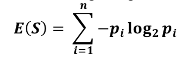
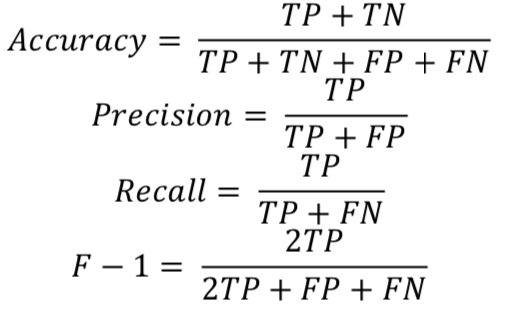

In the implementation of decision trees and random forests, the datasets dataset1.txt was used. These files were converted into CVS files, in order to handle
them in a better way and have been attached with the code for this project. The purity of datasets
was checked and then entropy was used as a measure of splitting the nodes in the dataset.
Firstly, entropy of the whole dataset was calculated which acted as a reference for later stages.
The splits with the lowest entropy were found. So, the information gain for a given attribute was
computed by taking the entropy of the whole set and subtracting it with the entropies of sets that
are obtained by breaking the whole set into one piece per attribute category.

The goal of decision tree was to find those descriptive features which contain the most "information" regarding the target feature and then split the dataset along the values of these features such that the target feature values for the resulting subsets were as pure as possible based on the measure of entropy. The descriptive feature which left the target feature most purely was the most informative one. This process was done until a stopping criterion was met which was the max_depth of the tree. The leaf nodes contained the rules for traversing the tree.

## Random Forest ##
Random forest was created by an amalgamation of decision trees. 20 percent of the features were randomly selected. Number of trees for random forest was decided to be 3. For each tree, randomly 80% of the records in the dataset were chosen with replacement. The best split for the decided feature was selected by using the decision trees implemented before. At the end, the results were combined and majority voting was used to ascertain the label of the record.

## Boosting ##
In boosting, the weights were initially assigned uniformly. A bootstrap sample based on weights was used in each case and the classification was kept track of for each record. The records who had been misclassified were given higher weights in new iterations and the records which were correctly classified were given the reduced weights for next iteration. Final prediction was weighted average of all the classifiers with weight representing the training accuracy.

## 10-fold cross validation ##
In 10-fold cross validation, data was divided into 10 disjoint subsets. The data was trained on 9 partitions whereas the last partition was used for testing purposes.

## Performance Measures ##
Accuracy, precision, recall, and F-1 measures were used for calculating the performance of algorithms.

## Results ##
The performance was measure for all the algorithms and results have been tabulated below:

| Accuracy  | 0.92 |
|-----------|:------:|
| Precision | 0.99 |
| Recall    | 0.92 |
| F-1       | 0.94 |
